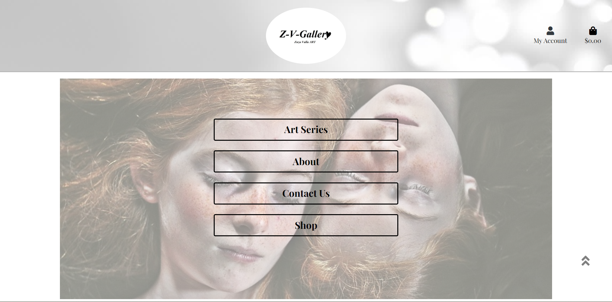
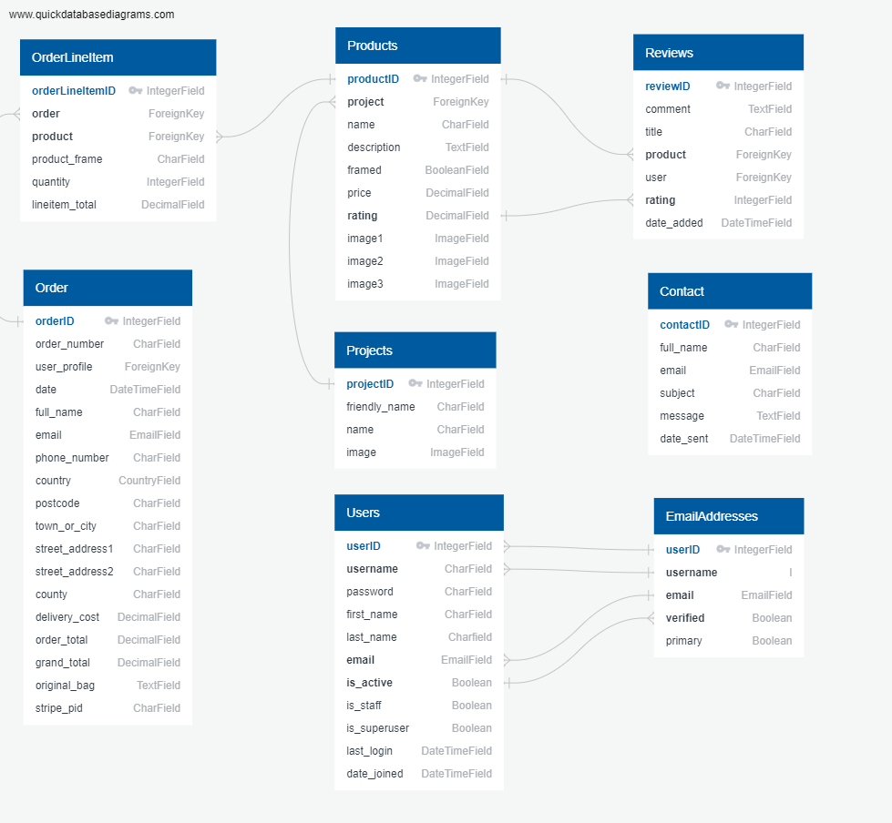
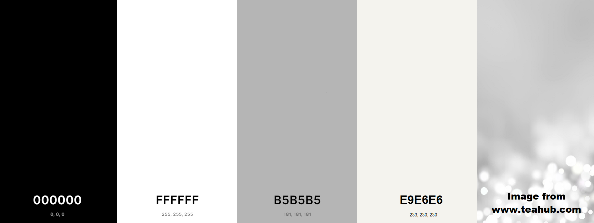

# Z-V-Gallery
## Code Institute: Milestone Project 4

Created by Ondrej Valla

## View [Z-V-Gallery](https://z-v-gallery.herokuapp.com/) website on Heroku.

---
The Z-V-Gallery (Zuzu Valla Gallery) website is my fourth ‘Milestone Project’ as part of the Full Stack Development course of Code Institute. The focus lies on using the Django framework, using an authorisation and authentication system and using Stripe payment system. I believe this website could be a fundation for the real online store, selling printed portraits of Zuzu Valla's work in the future.

---
## * PLEASE NOTE! *

### This website is for educational purposes only. 
### Don’t use real credit card details, instead use the following details for testing purposes:  
Card number: 4242 4242 4242 4242   
Use any expiration date (month/year) in the future and any CVC code.

Thank You for understanding, Enjoy!

--- 

# Table of Content
1. [Overview](#overview)

2. [Goals](#goals)

3. [User Experience](#user-experience)
   

4. [Wireframes](#wireframes)

5. [Features](#features)

6. [Used Technologies](#used-technologies)

7. [Testing](#testing)

8. [Bugs](#bugs)

9. [Deployment](#deployment)

10. [Credits](#credits)
---

# Overview

The Z-V-Gallery website is here for all the fans of Zuzu Valla. People have a great opportunity to purchase printed portraits of Zuzu Valla's work. Users can choose to get prints of their choice unframed, or framed in white or black frame and delivered worldwide, straight to their door.

---

# Goals

### User goals:
1. The website to be user-friendly.
2. The website to be visually appealing to users.
3. Easy to navigate website.
4. Ability to register / log in 
5. To be able to save my billing details in my profile for the future.
6. To be able to review products.
7. Easy to use payment system.

### Developer/Admin goals:
1. Have a well-designed / responsive website.
2. To be able to create / manage different project categories and be able to upload products for each category.
3. Use MySQL and Postgres databases effectively.
4. To see users profiles, reviews and messages in the database.
---

# User Experience

## **Strategic level**

I am definitely one of the biggest Zuzu's fan and I always like to find the way how to share her amazing photography work with others. I came up with the idea of website selling Zuzu's prints as soon as I found out, that the last project will be an online store.

Users can browse this website and find out bit more about Zuzu and her photographs.
Users can create an account to safe their order order history and billing details.

The target audience are people interested in the photography.
These can be people, who already know Zuzu Valla, same as people who dont know her yet, never seen her work and want to find out more about her photography. Or returning users, for instance people who have seen her images before and want to go a step further and purchase some of them.

The primary goal is to deliver an interactive web app with gallery portfolio style, which provides its users the ability to purchase framed or unframed piece of printed art. 

The project goal is to show my knowledge I have learned from The Code Institute course and apply it in this project.

## **User Stories**

#### General Site Users / Shoppers

As a general site user, I would like to:
1.  see the content of the page.
2.  see the content, be able to see all Prints and prices.
3.  view other users reviews.
4.  be able to see individual projects.
5.  see all products added in to the shopping bag.
6.  be able to adjust the shopping bag before checkout.
7.  be able to purchase prints as a guest, without creating the profile.
8.  get the confirmation email after the purchase.
9.  be able to register and create my profile.
10. be able to contact the store owner, for further details.
11. find out more through social media.

#### Registered Users  

As a registered user, I would like to:
1. be able to easily login and log out.
2. save and edit my billing details in my profile.
3. see my purchase history details.
4. be able to comment / review products.
5. be able to edit, or delete my review.
6. easily change my forgotten password.

#### Admin User

As an Admin user, I would like to:
1. be able to create new project categories.
2. edit or delete existing project categories.
3. be able to add new products with all the details and images.
4. be able to edit or delete uploaded products.
5. MySQL and Postgres database to store page content effectively and safely.
6. have a access to all website messages, reviews and user profiles / email addresses through my Admin loggin in the database.

## **Scope level**
Based on the user stories I have applied the following requirements:

### **Requirements**
1.  A responsive design.
2.  A home page with navigation menu, About section, Photography projects section, Small Gallery(for desktop view only).
3.  An about section on the home page where users can get more information about Zuzu Valla.
4.  A photography projects section on the home page, where users can see individual projects.
5.  A shop page where all available prints are displayed.
6.  An option to search the prints on the shop page.
7.  An option to sort prints by the individual project.
8.  Individual pages for each prints / products with the framing preview and the ability to choose the frame and the quantity.
9.  Reviews section at the bottom of each product details page with the ability to add, edit or delete the review for 
    registered users.
10. An option to register and login/logout.
11. A profile page where registered users can add or edit billing information and see their order history details.
12. Contact page with the contact form. Receiving confirmation email with the message and sender details for admin and the user.
13. A shopping cart icon with relevant info that is displayed at all times.
14. A shopping cart page with all the items in the bag. Ability to adjust the bag.
15. A checkout page with details on the shopping items.
16. Secure checkout via Stripe payment.
17. Email confirmation on purchase.
18. An admin pages with options to Create or Edit prints / products.
19. Defensive programming, e.g. confirmation on deleting, logging out, etc.

## **Structure Level**
The overall look is kept the same on each page as much as possible.
- The header and footer are kept the same on each page.
- Buttons are styled in the similar way.
- The used color style is kept on each page.

The navigation is kept simple and consistent:
- The logo at the top of the page is also the link to the home page.
- Buttons can be used to navigate.

The information provided should be easily visible for the user:
- Messages(toasts) in the right top corner, are used to confirm or inform about current actions.
- Modal delete pop ups are used as defensive programming, prompting the user if they are sure of their action.
- The user gets a feedback when an error has occurred.

### **Pages**
#### **Frontend**

The website has 12 main content pages plus account registration / login pages. Each page has a header with the logo linked to the Home page, and a footer.
The links in the header are shown depending on whether a user is logged in or not and if the user is the admin or not.
When a user is not registered nor logged in, the register and login links are shown in My Account section.
When a user is logged in, the register and login links are hidden and a profile link and logout link are shown in My Account section.
When the user is admin, an extra link for the Product Management is shown.

The footer has a section with links to social accounts and a link to GitHub repository of this page.

- **The landing page (Home page):** 
This is the first page a user can see when they come to the site. There is a hero image with the Navigation Menu.
The Navigation Menu has links to the About section, Art series section, Contact Us page and Shop page.
Below the menu, there is an About section.

-About section: 
 Informations about Zuzu Valla plus the button (CONTACT) linked to the contact.html page.

-Art Series section:
 Cards of individual projects. Each card has an button (SEE PRINTS) linked to the products.html (shop page) displaying prints of selected project.

-Gallery section:
 Only visible on medium and larger screen resolutions. This is the section showing nine random images from Zuzu Valla's portfolio. Each image features the function of changing to black and white on hover.

- **The products page (Shop page):**
The heading of this page is Prints. On this page all available prints for sell are displayed. Each print has image, name, project name, price, rating and for admin use only: edit/delete buttons.

- **The product details page:**
The heading of this page is Details. On this page individual/clicked print is displayed with further details. There is the name of the print, description, three images, white framed image, black framed image and no frame image. Underneath is the edit/delete button for Admin use only, the price, rating, followed by the frame option selector, quantity selector and one keep shopping button and add to bag button.
- **The product details/reviews page:**
This page is only displayed as a part of the product details page. This page contains heading Reviews with the count of total reviews for selected print and the current average rating. Underneath there are individual reviews. 
For the user who wrote the review, there is an option to edit, or delete the review.

- **The contact page:**
This page has a contact form, where the user can ask questions or give remarks. 
A confirmation email is sent to the user’s email address after submitting.

- **The sign up page:**  
This page has a signup form where the user can register and create an account. After registration 
the user is asked to confirm their email address. After confirmation the user is redirected to the
home page. There is a button to go to the login page, if a user already has an account.

- **The sign in page:**  
This page has a login form where users that have an account can login. After login the user will be 
redirected to the home page. There is a button to the register page, in case the user has no account.

- **The profile page:**  
This is the personal page of the user. Here the user can see and edit their shipping information, 
see an overview of their orders (with a link to that order confirmation page).

- **The product management page:**  
On this page, the admin can add a new print / product by filling in the form. After submitting the admin 
is redirected to the individual page of the added print / product.

- **The edit product page:**  
On this page, the admin can edit an existing print / product by editing the pre filled form. After submitting the admin is redirected to the individual page of the added print / product.

- **The shopping bag page:**
If the shopping bag is empty, the user is informed by the text, saying the shopping bag is empty and the Keep shopping button.
When there are items in the bag, the user is able to see the table with product informations such as: Product image, name, price, whether or not framed, quantity with the update/remove option and subtotal.
On the bottom of the page, there is bag total sum, delivery charge, grand total sum, keep shopping button and secure checkout button.

- **The checkout page:**  
This page has an form the user has to fill out to complete their order. The user has to provide delivery information and credit card details. After submitting the form, the user gets a confirmation email.
There is also an order summary view, showing all items in the bag, subtotals and grand total including delivery charges.

- **The checkout success page:**  
This page is shown when the payment was successfull. It has an overview of the order, delivery details and payment details.

#### **Backend**
During development the Sqlite3 database is used. This is the default database used by Django.
During production HerokuPostgres is used in conjunction with deployment on Heroku.

---
### **The Chart of the database models**

---

### **Images Used**

Website's Header and Footer background image is downloaded from:
[www.teahub.io](https://www.teahub.io/viewwp/iTTm_1920x1080-white-abstract-wallpaper-desktop-background-abstract-white/)

All other images used on this website are own by my wife, Zuzana Valla a.k.a. Zuzu Valla.

### **Colors**

The website's color theme is MOSTLY White with the combination of different shades of Grey color and texts are black or "text-dark" Bootstrap class.

- rgba(0, 0, 0,) black is mostly used for text color, a part of text with the Bootstrap class of "text-dark".
- rgba(255, 255, 255,) white is used accross the page to create nice, clean gallery style background.
- rgba(181, 181, 181,) shade of gray is used for border colors.
- rgba(233, 230, 230,) used for review cards and hovers
- Image from www.teahub.com is used
- The standard colours of Bootstrap for success, info, danger and warning were also used.

### **Typography**
For the headings (h1 to h6) and paragraphs I've used 'Playfair Display' fonts and sans-serif fonts as a backup.

### **Icons**

- To achieve better appearance and user experience, Font Awesome icons are used in this website.
- The source: [Font Awesome](https://fontawesome.com/)

---

# Wireframes

The final appearance of the website vary from original wireframes, however, the main structure / idea has been followed.

- [Wireframes for Home Page PC](media/readme-files/wireframes/home-page-pc.png)
- [Wireframes for Home Page Mobile](media/readme-files/wireframes/home-page-mobile.png)
- [Wireframes for Home Page Tablet](media/readme-files/wireframes/home-page-tablet.png)
- [Wireframes for Art series section home page PC](media/readme-files/wireframes/art-series-section-pc.png)
- [Wireframes for Art series section home page Mobile](media/readme-files/wireframes/art-series-section-mobile.png)
- [Wireframes for Art series section home page Tablet](media/readme-files/wireframes/art-series-section-tablet.png)
- [Wireframes for Product Details PC](media/readme-files/wireframes/product-details-pc.png)
- [Wireframes for Product Details Mobile](media/readme-files/wireframes/product-details-mobile.png)
- [Wireframes for Product Details Tablet](media/readme-files/wireframes/product-details-tablet.png)

---

# Features

- **Responsiveness** on all viewports, which allows users to use the website probably on all devices.
- **Burger menu**, which allows users to easily navigate the website on devices below 992px. This menu creates a cleaner and more organised look for smaller screen devices.
- **Search bar**, which allows users to search prints, by entering a keyword into the search bar.
- **View by project** will display only prints of selected project.
- **Contact form** is a great feature for users to get in touch with the owner of the website.
- **Delete modal** as a defensive programming tool, which allows users to double confirm to delete their review.
- **Register functionality**, which allows users to create an account, by filling in the register form. 
- **Login functionality**, which allows users to log in their account, by filling in the login form. 
- **Logout functionality**, which allows users to log out of their account, by clicking the logout button.
- **Stripe functionality**, which simulates a safe enviroment for payments by credit card.

- **CRUD functionality (Create, Read, Update, Delete) functionality:**

    *Create:*  
    - Admin can create / add new prints / products.  
    - Users can create a review for a print / product.

    *Read:*  
    - All users can search and view prints / products.

    *Update:*
    - Admin can edit prints / products.  
    - Users can edit their own review.

    *Delete:*
    - Admin can delete prints / products.  
    - Users can delete their own review.

## Features left to implement

- Register and Login by using Social media account.
- Sign up for the Newsletter feature.
- Add the your favorite prints to the Favourite / Wishlist list displayed on profile page.
- Functional setup of Stripe, to make the payment gate fully functional.

---

# Used Technologies

### **Languages used**  
- [HTML5](https://en.wikipedia.org/wiki/HTML) for markup.  
- [CSS](https://en.wikipedia.org/wiki/CSS) for styling.
- [Javascript](https://en.wikipedia.org/wiki/JavaScript) for interactivity.
- [Python3](https://www.python.org/) for backend programming.

### **Frameworks and libraries used**   
- [Bootstrap v4.4.1](https://getbootstrap.com/) a frontend-framework with precoded code-snippets, like navigation bar, modals, and to help with the responsiveness of the website.
- [jQuery](https://jquery.com/), a javascript library for easier DOM traversing and manipulation and shortening of javascript. 	
- [Google fonts](https://fonts.google.com/) for the fonts used on the website. 
- [Font Awesome](https://fontawesome.com/) for the icons used on the website. 
- [Django](https://www.djangoproject.com/) is a high-level Python web framework that encourages rapid development and clean, pragmatic design. 

### **Tools and Programmes used**
- [Balsamiq](https://balsamiq.com/) for making the wireframes. 
- [Chrome Developer Tools](https://developers.google.com/web/tools/chrome-devtools)
 to debug and checking/testing the website.
- [Git](https://git-scm.com/) for version control.  
- [GitHub](https://github.com/) for storing the files and version control of the website.  
- [PostgreSQL](https://www.postgresql.org/) used as an open source relational cloud database after development to Heroku.
- [Amazon AWS](https://aws.amazon.com/) used to store static files after deployment.
- [Heroku](https://www.heroku.com/) a cloud platform for deploying the website.
- [W3C Markup Validation Service](https://validator.w3.org/) to validate Html files.
- [W3C CSS Validation Service](https://jigsaw.w3.org/css-validator/) to check the CSS-code.
- [JSHint](https://jshint.com/) to check the Javascript code.
- [PEP8 checker](http://pep8online.com/) to check the python code for PEP8 requirements. 
- [Favicon.io/](https://favicon.io/) to create the favicon for the website.
- [Coolors](https://coolors.co/) to make the colour scheme.
- [quickdatabasediagrams.com](https://quickdatabasediagrams.com) to create the database diagram.

