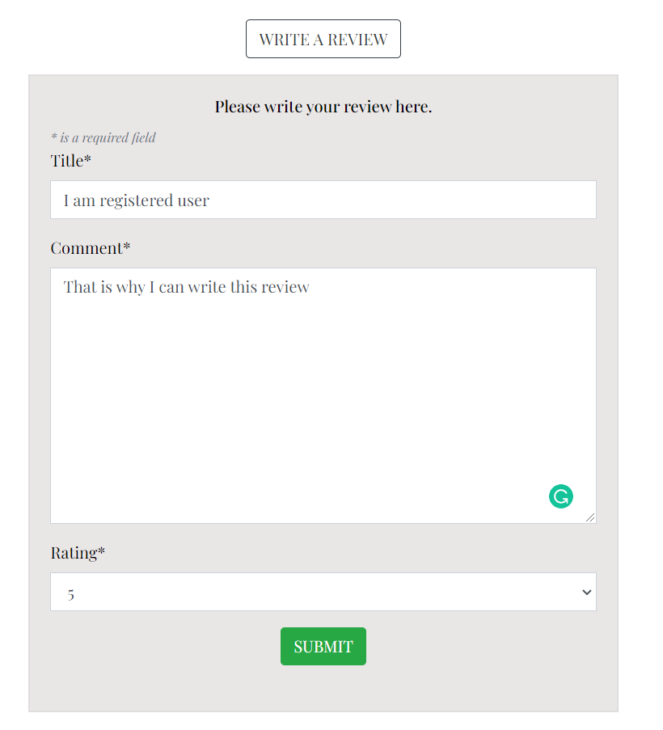

Go back to the [README file](https://github.com/OndrejValla/Z-V-GALLERY/blob/main/README.md)

# **Testing**
## Table of Contents
- [Testing User stories](#testing-user-stories)  
    * [General Site Users](#general-site-users)
    * [Registered Users](#registered-users)
    * [Admin User](#admin-user)
- [Manual testing](#manual-testing)
- [Code Validation](#code-validation)  
    * [HTML](#html)
    * [CSS](#css)
    * [Javascript](#javascript)
    * [Python](#python)
- [Browser compatibility](#browser-compatibility)  
- [Responsiveness](#responsiveness)  
- [Bugs](#bugs)  
***

## **Testing user stories**

### **General Site Users / Shoppers**

### As a general site user, I would like to:
    1.  see the content of the page.
         The content of the page is unlocked for all users. Whether or not registered, users can browse the main page, products (SHOP) page and contact page. 

    2.  be able to see all Prints and prices.
         All users are able to see product details, images, average rating and prices. and reviews.
         

    3.  view other users reviews.
         All users are able to see product details including reviews.
         

    4.  be able to see individual projects.
         On the Home page, there is a section, where users are able to see a card for each project. This card contains image of the project, name of the project and button link which takes users to the products (SHOP) page displaying only project's prints.

    5.  see all products added in to the shopping bag.
         All site users are able to add products in the bag. After a product is added in to the bag, the bag icon in the right top corner change the color and a small bag content (toast) card displays the current content of the shopping bag.
         
         Also after clicking the shopping bag icon, user is directed to the shopping bag page, where is able to see all the items in the bag.

    6.  be able to adjust the shopping bag before checkout.
         Before user decide to click Secure Checkout button on the bottom of the shopping bag page, there is an option to update the bag content by using plus + and minus -  buttons for the item quantity. Update and remove button to update the quantity or to remove the item from the bag.
         

    7.  be able to purchase prints as a guest, without creating the profile.
         All site users can make a purchase. For unsigned or unregistered users, there are register and login buttons underneath of the billing form, to give them a option to register or login.
         Once the user is registered and signed up, there is a checkbox, to save billing details in to the profile.
         

    8.  get the confirmation email after the purchase.
         In the checkout billing form, there is a mandatory field for users email address. After the purchase, user does receive a confirmation email with al the order details.
         

    9.  be able to register and create my profile.
         Unregistered users have a option to register. After registration, they are able to login and view their profile. Once they are registered and make a purchase, order history is displayed in the profile page.
         

    10. be able to contact the store owner, for further details.
         If site users have any questions or concerns, they have a option to contact the site owner through the contact form page. 
         After sending the message, they receive the confirmation email with their message, ensuring them, that the message was succesfully send. The site owner is also receiving the email with customer's message and details.
         
    
    11. find out more through social media.
         On the bottom of the page, in the footer section, there are two social media links, directly taking users to Zuzu Valla's Instagram profile and LinkedIn profile.

### **Registered Users**

### As a registered user, I would like to:
    1.  be able to easily login and log out.
         On all pages in the right top corner, there is My Account section with Login button, and if already logged in, Logout button.
         When Login in, the login page is loaded asking users to fill up their login details.
         Once logged in, logout button in right top corner takes users to the logout page, double checking whether the user wants to log out.

    2.  save and edit my billing details in my profile.
         Users can manualy fill out the billing details in their profile, or when they are making the purchase, they can click the tickbox on the checkout page, confirming, that they wish to save their billing details in to their profile for the future use. All very simple process.
         

    3.  see my purchase history details.
         CURRENTLY ONLY WORKING for registered users with their profiles created before the purchase. 
         This is one of the current BUGS which I am hoping to sort out in the future.
         

    4.  be able to comment / review products.
         Registered users are able to leave one review under each product.
         

    5.  be able to edit, or delete my review.
         Once the review is submitted, registered (logged in) user is able to go back and click Edit or Delete buttons on the bottom of the review. These two buttons are only displayed to the user under their review.
         

    6.  easily change my forgotten password.
         This website has pre-programmed forgotten password sites and logic from the Django framework. All works well and easy. 
         User just click on Forgot password button in the Login section and then follow the instructions, starting with filling the account email address. Then user receives the email with the link to follow to change and save their new password.  

### **Admin User**

### As a Admin user, I would like to:
    1.  be able to create new project categories.
         This function is currently only available through the admin section of this page.
         After the category is created, new category card is shown in the home page Art series section.

    2.  edit or delete existing project categories.
         As mentioned above, this function is currently only available through the admin section of this page.
         Admin is able to edit the category name and image.

    3.  be able to add new products with all the details and images.
         This function is available for the Admin user from the main page or from the Admin section of the page.
         On the main page, in the right top corner, there is a link (displayed only for the admin) Product Management in My Account dropdown menu.
         This Product Management link takes admin user to the Add a product page where is a form to fill up with all the relevant fields for each product. See picture for more details.
    
    4.  be able to edit or delete uploaded products.
         In the products page there is a little edit button (visible for the Admin only) which opens the Edit a Product page of the Product Management section with loaded details of the individual product. The structure of the form is exactly the same as a form of Adding a product page. After details being updated / changed, Admin can click Save Product button to save changes. Alternatively the Admin can click Cancel button to return back to the products page.

         There is exacly same Edit option in the product details page, underneath the individual product images. 
         Additionaly there is a little Delete button next to the Edit button alowing the Admin user to delete this product. After the Delete button is clicked, The Delete Modal shows up, souble checking whether the Admin user is sure to delete the product.

         

         The product edit and delete functionality is also available for the Admin user in the admin section of the page, where admin can select each of the products, edit it or delete it.
 
    5.  MySQL and Postgres database to store page content effectively and safely.
         Both of the databases was working very well during the process of building and testing of this page.

    6.  have a access to all website messages, reviews and user profiles / email addresses through my Admin loggin in the database.
         This is all accessible for the Admin user.
---

## **Manual testing**

**Registration functionality**  
Expected:   
A user can register to the website by filling in the sign up form correctly.

Testing:
1. Go to the signup page by clicking 'my account' and then on 'signup' in the dropdown menu in My Account section.
2. Don't fill in the signup form and click 'Sign up'.
3. Confirm that a warning message appears.
4. Only fill in an email address and click 'Sign up'.
5. Confirm that a warning message appears.
6. Repeat steps 4 and 5 for username and password.
7. Fill in an email address, a unique username and a password.
8. Confirm that the message 'Verify your e-mail address' appears.
9. Confirm that a toast message appears with the text 'Confirmation e-mail sent to (your email address)'.
10. Go to your email inbox and confirm an email was sent to confirm your email address.
11. Click the link in the email.
12. Confirm that you're redirected to a page to confirm your email address.
13. Click the 'Confirm' button.
14. Confirm you are redirected to the signin page.
15. Confirm a success toast message appears with the text 'You have confirmed (Your Details).'
16. Log out by clicking the logout button in the navbar.
17. Repeat the sign up process with the same details you entered before.
18. Confirm that the message 'A user is already registered with this e-mail address.' appears.

Result:  
A user can register to the website by filling in the register form correctly.
All functionalities mentioned above are functioning correctly.

**Login functionality**  
Expected:   
A user can log in to the website by filling in the login form correctly.

Testing:
1. Go to the sign in page by clicking 'my account' and then on 'signin' in the dropdown menu in My Account section.
2. Don't fill in the login form and click 'Sign in'.
3. Confirm that a warning message appears.
4. Only fill in the username and click 'Sign up'.
5. Confirm that a warning message appears.
6. Only fill in the password.
7. Confirm that a warning message appears.
8. Fill in a wrong username and password.
9. Confirm that the message 'The username and/or password you specified are not correct.' appears.
10. Fill in your username and password.
11. Confirm you are redirected to your home page.
12. Confirm a success toast appears with the text 'Successfully signed in as (your details)'.

Result:  
A user can log in to the website by filling in the login form correctly.
All functionalities mentioned above are functioning correctly.

**Logout functionality**  
Expected:   
A user is logged out when they click on the logout link in the dropdown menu in My Account section.

Testing:
1. Log in.
2. Click on 'my account' and then on 'signout' in the dropdown menu.
3. Confirm that you are redirected to a new page with a warning message 'Are you sure you want to sign out?'.
4. Click 'Cancel'.
5. Confirm you are still logged in and are redirected to the home page.
6. Repeat steps 2 and 3.
7. Click 'Sign out'.
8. Confirm you are redirected to the Home page.
9. Confirm you are logged out from the website and a success toast message 'You have signed out.' appears.

Result:  
A user is logged out when they click on the logout link in the dropdown menu in My Account section and the sign out button on the sign out page.  
All functionalities mentioned above are functioning correctly.

**Search bar functionality**  
Expected:  
A user can use the search bar in products (SHOP) page and search products by keyword (name or words in the description).

Testing:
1. On products page, click the search bar at the top of the page.  
2. Fill in the keyword e.g. 'bath' in the search bar.
3. Confirm that products in the bath are shown.
4. Fill in the keyword 'mill' in the search bar.
5. Confirm that the print 'Siobhan' is displayed.
6. Click on the print to go to the product detail page.
7. Confirm the word 'mill' is in the description for this print.

Result:  
A user can use the search bar and search products by keywords (name or description).
All functionalities mentioned above are functioning correctly.

**View by Project dropdown menu functionality**  
Expected:  
A user can use the View by Project on the products page to display the products by individual projects.

Testing:
1. Go to the products page, click on the View by Project dropdown menu and select one of the projects.
2. Confirm that only prints with selected project category are displayed.
3. Repeat steps 1 and 2 for the other projects.
4. Click on the 'All Projects' button.
5. Confirm that all prints are displayed.

Result:  
A user can use the Project dropdown menu on the products page to display products / prints by their project name.
All functionalities mentioned above are functioning correctly.

**Stripe functionality**  
Expected:  
When a user buys a product / print, the Stripe payment process is secure and working.  

Testing:  
1. Go to the shop page and select a product and click 'add to bag'. 
2. Click the 'Go to secure checkout' button and then the 'Secure checkout' button.
3. Fill in the delivery information form.
4. For the credit card payment information use 4242 4242 4242 4242, any date in the future, any cvc number and any postcode and click 'complete order'.  
5. Confirm you are redirected to the checkout succes page with an overview of your order.
6. Confirm a success toast message appears with the text 'Order successfully submitted! A confirmation email will be sent to (email). 
7. Check your email inbox and confirm you have received an email confirmation.
8. Log in to your stripe account, go to 'Payments' and confirm the payment was succesfull.
9. Log in to the django admin of the site, go to Orders and confirm the order was created.
10. Repeat steps 1 to 4 but use 4000 0000 0000 3220 for the credit card payment information.
11. Confirm a 3D Secure 2 authentication message pops up.
12. Click 'Fail' and confirm that you are redirected to the checkout page and a message with the text 'We cannot verify your payment method. Please select another payment method and try again, appears underneath of the card payment field'.
13. Repeat steps 10 and 11 and confirm the payment by clicking 'Complete'.
14. Confirm you can repeat steps 5 to 9.
15. Repeat steps 1 to 4, but use 4000 0000 0000 9995 for the credit card payment information.
16. Confirm the payment has failed and a message appears underneath of the card payment field stating that your card has insufficient funds.

Result:  
When a user buys a product, the Stripe payment process is secure and working.
The checkout functionality of the page is all working well.
All functionalities mentioned above are functioning correctly.
Note: for the futher testing of Stripe see their guide on [testing](https://stripe.com/docs/testing)

**Delete Modal functionality**  
Expected:  
A modal asking the Admin to confirm their action, when the Admin clicks a 'delete' button under the product in product details page.

Testing:
1. Log in as admin.
2. Go to the products page and click on any print / product.
3. On product details page, underneath of product images, click the 'Delete' button.
4. Confirm a modal pops up that says 'Are you sure you want to delete this product?'.

Result:  
A modal does pop up asking the Admin to confirm their action, when clicked a 'delete' button.
All functionalities mentioned above are functioning correctly.

**Social icons**  
Expected:  
The user is redirected to the respective social media page (Instagram and LinkedIn), when they click on a social media icon.

Testing:
1. Go to the footer.
2. Click on a social media icon.
3. Confirm you are redirected to that social media page.
4. Confirm that the page is opened in a new window.
5. Repeat steps 2, 3 and 4 for both icons.
6. Same principals applies for GitHub Icon. The GitHub page with the repository of this website is shown.

Result:  
The user is redirected to the respective social media page, when they click on a social media icon.
Same applies for the GitHub link.
All functionalities mentioned above are functioning correctly.

**The Contact form functionality**  
Expected:  
The user can send the site owner a message by filling in the contact form.

Testing:
1. Go to the contact page by clicking on 'Contact button link'.
2. Confirm you are redirected to the contact page.
3. Don't fill in the contact form and click 'Send'.
4. Confirm that a warning message appears.
5. Fill in the contact form except for the full name and click the 'Send' button.
6. Confirm that a warning message appears.
7. Repeat steps 5 and 6 for the email address, subject and message inputs.
8. Fill in the complete contact form and click the 'Send' button.
9. Confirm that a success toast appears with the message 'Your message was sent successfully!'.
10. Go to your email inbox and confirm a confirmation email was sent to your email address.
11. Log in to the django admin of the site, go to Received contact forms and confirm the contact form was created.

Result:  
The user can send a message to the site owner by filling in the contact form.
All functionalities mentioned above are functioning correctly.

#### CRUD (Create, Read, Update, Delete) functionalities.

**CRUD for the User:**

**Add Review**  
Expected:  
A new review is created and displayed under the product / print when the user fills in the add review form under the product / print.

Testing:
1. Log in and go to the products (SHOP) page.
2. Select any product / print and scroll down to Reviews section.
3. Click on the 'Write a review' button.
4. Confirm a add review form does appear.
5. Don't fill out the review form and click the 'Submit' button.
6. Confirm a warning message appears.
7. Fill in the review form, except the review title.
8. Confirm a warning message appears.
9. Repeat steps 6 and 7 for comment and rating.
10. Fill in the review form and the click the 'Submit' button.
11. Confirm that a succes toast message appears with the text 'Review succesfully added!'
12. Confirm you stay at the product details page.
13. Scroll down and confirm that your review is added to the Reviews.

Result:  
A new card with the review is added when the user fills in the add review form.
All functionalities mentioned above are functioning correctly.

**Edit your review**  
Expected:  
An existing review can be edited by the user when the user fills up the edit review form.

Testing:
1. Log in.
2. Go to the products page and click on the product You have previously reviewed.
3. Scroll down to the reviews section to see your review.
4. Confirm that your review has an 'Edit Review' button.
5. Click the 'Edit Review' button and confirm you are redirected to the edit review page.
6. Confirm the form is prefilled with the data of the existing review.
7. Change any of the input fields.
8. Click the 'Save Review' button.
9. Confirm that a succes toast message appears with the text 'Your review is edited successfully!'
10. Confirm you are redirected back to the product details page.
11. Scroll down to Reviews and confirm that your change is shown in the review.

Result:  
An existing review is edited when the user fills in the edit review form.
All functionalities mentioned above are functioning correctly.

**Delete review**  
Expected:  
A review is deleted when the user clicks on the 'DELETE' button of a review delete modal.

Testing:
1. Log in.
2. Go to the products page and click on the product You have previously reviewed
3.  Scroll down to the reviews section to see your review.
4. Confirm that your review has a 'Delete' button.
3. Click the 'Delete' button and confirm a modal pops up with the message 'Are you sure you want to delete this review?'
4. Click 'Delete'.
5. Confirm that a succes toast message appears with the text 'Your review has been deleted.'
6. Confirm you stay at the product page.
7. Scroll down to Reviews and confirm the review is deleted.

Result:  
A review is deleted when the user clicks on the 'DELETE' button of a review delete modal.
All functionalities mentioned above are functioning correctly.

**CRUD for The Admin:**

**Add product / print**  
Expected:  
A new product / print is added when the admin fills up the add product form in the Product Management section. 

Testing:
1. Log in as admin.
2. Click on 'My Account' and then on the 'Product Management'.
3. Confirm you are redirected to the Product Management page.
4. Don't fill out the form and click the 'Add Product' button.
5. Confirm a warning message appears.
6. Fill in the form, except the name field.
7. Confirm a warning message appears.
8. Repeat steps 6 and 7 for the other fields that are required.
9. Fill in the review form and the click the 'Add Product' button.
10. Confirm that a success toast message appears with the text 'Successfully added product!'
11. Confirm you are redirected to the product details page of recently added product / print.

Result:  
A new product / print is added when the admin fills up and submits the add product form.
All functionalities mentioned above are functioning correctly.

**Edit product / print**  
Expected:  
An existing product / print is edited when the admin fills up the edit product form.

Testing:
1. Log in as admin.
2. Go to products (SHOP) page and select one product / print.
3. Confirm you are redirected to the product details page.
4. Confirm there is an 'Edit' button.
5. Click the 'Edit' button and confirm you are redirected to the product management page, Edit a Product section.
6. Confirm the form is prefilled with the data of the existing product / print.
7. Change any of the input fields.
8. Click the 'Save Product' button.
9. Confirm that a success toast message appears with the text 'Successfully updated product!'
10. Confirm you are redirected to the product details page of recently edited product.
11. Confirm that your change is shown.

Result:  
An existing product / print is edited when the admin fills up and submits the edit product form.
All functionalities mentioned above are functioning correctly.

**Delete product / print**  
Expected:  
A product / print is deleted when the user clicks on the 'DELETE' button of a product / print delete modal.

Testing:
1. Log in as admin.
2. Go to products (SHOP) page and select one product / print.
3. In product details page, click the 'DELETE' button.
4. Confirm a modal pops up with the message 'Are you sure you want to delete this product?'
5. Click 'YES'.
6. Confirm that a success toast message appears with the text 'Product deleted!'
7. Confirm you are redirected to the products (SHOP) page.
8. Confirm the product is deleted.

Result:  
A product / print is deleted when the user clicks on the 'DELETE' button of a product / print delete modal.
All functionalities mentioned above are functioning correctly.

---

## Code validation

### HTML
[W3C Markup Validation Service](https://validator.w3.org/)

As we are using Python language together with the Django frameworks, the standard validation of HTML files is not accurate. 
That is why HTML files validation reports are showing errors and warning.
However No major issues detected.

This is the screenshot of profile.html file. All other HTML files in this project are having same / very similar Errors and Warnings.

         

---
### CSS  
[W3C CSS Validation Service](https://jigsaw.w3.org/css-validator/) is used to check all CSS files of this web document.

All CSS files came out with no issues.

         

---
### Javascript  
[JSHint](https://jshint.com/) is used to check the validity of all Javascripts of this web document.

This is the outcome for all JavaScript files, with no major issues.

         
         
         
         

---
### Python  
[PEP8 online](http://pep8online.com/) is used to check the python code for PEP8 requirements.

I used the package AUTOPEP8 [autopep8 1.6.0](https://pypi.org/project/autopep8/) to make my Python files pep8 compliant.
The most of the files are fully compliant, except a few files below. 
No major issues detected.

         
         
         
         
         
         

---

### Lighthouse of Google Developer Tools

**DESKTOP REPORT**
         

**MOBILE REPORT**
         
